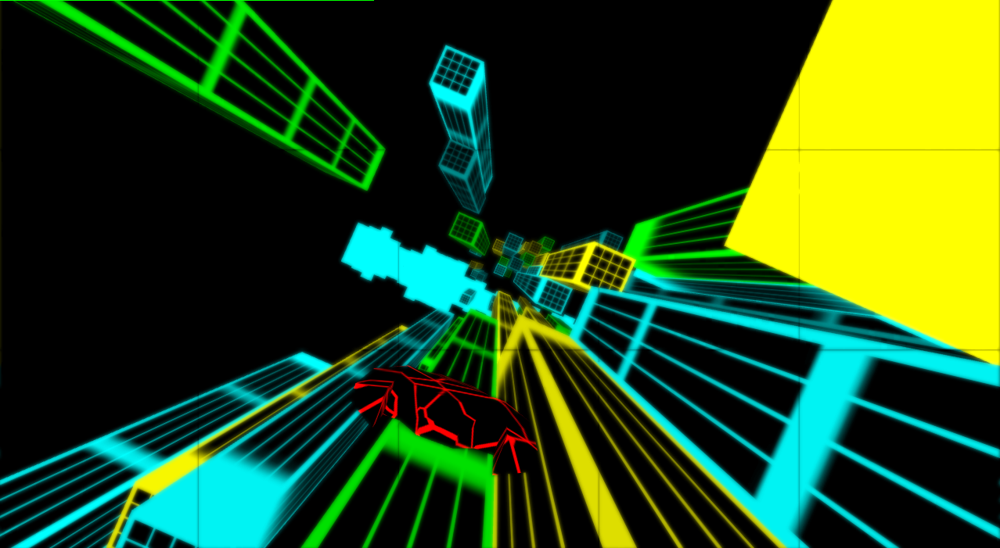
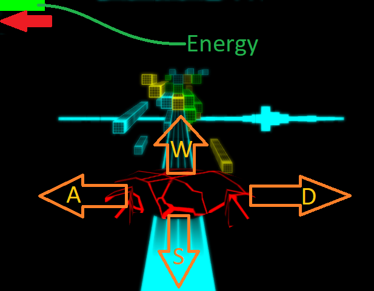
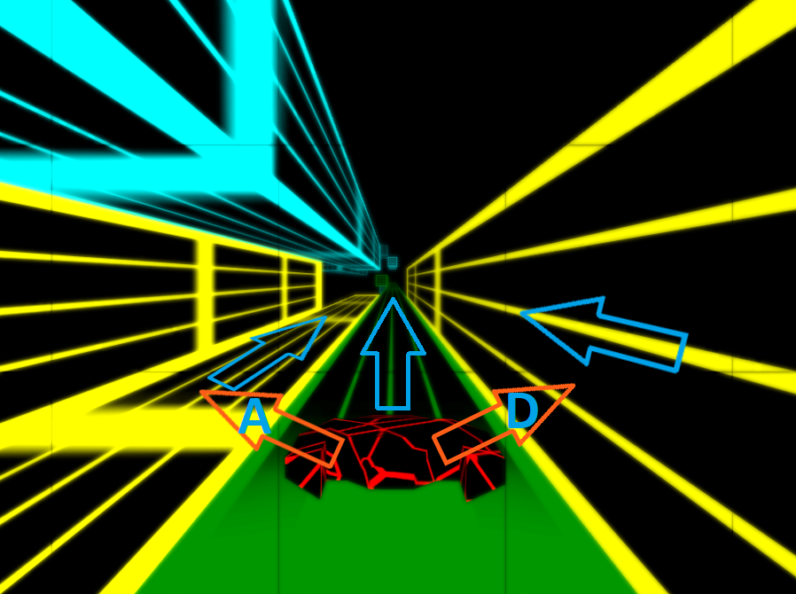

# Project
This game was a 2-week-project of the CGA (computergraphics & animations) modul.\
The focus of this project was to use the new knowledge of the lecture.

# NeonFall
\
NeonFall is an tron-themed music-game.\
But because of time issues the music-influenced graphics and gameplay mechanics was never implemented.\
So there is code which is never or underused.

# Start the Game
Just open the NeonFall.jar file and click on the top green box.

# Controls
You have 2 states in the game.
- Freefall
- Driving

## Freefall ##

While freefall you can move freely in space and land on tracks with W,A,S,D.\
But you lose energy which results in a game over by reaching 0 energy.\
Also by colliding with any front of a track you lose.\
If you now land on a track you are going into driving-state.

## Driving ##

While driving you can switch the sides on the track and jump onto other tracks with A & D.\
You regain slowly energy while driving and can also switch to freefall by pressing W.

# Artists Copyright
Running In The Streets by Vyra | https://soundcloud.com/vyramusic \
Music promoted by https://www.free-stock-music.com \
Creative Commons Attribution-ShareAlike 3.0 Unported \
https://creativecommons.org/licenses/by-sa/3.0/deed.en_US
