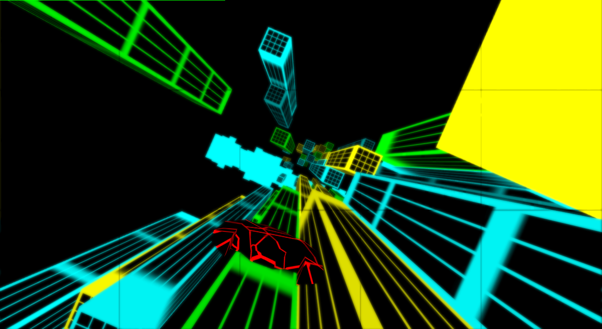
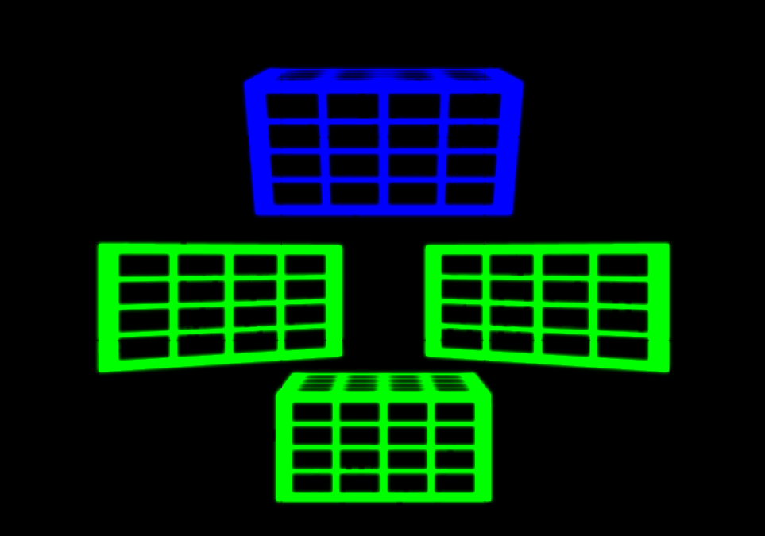
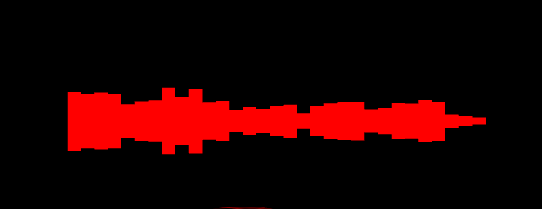
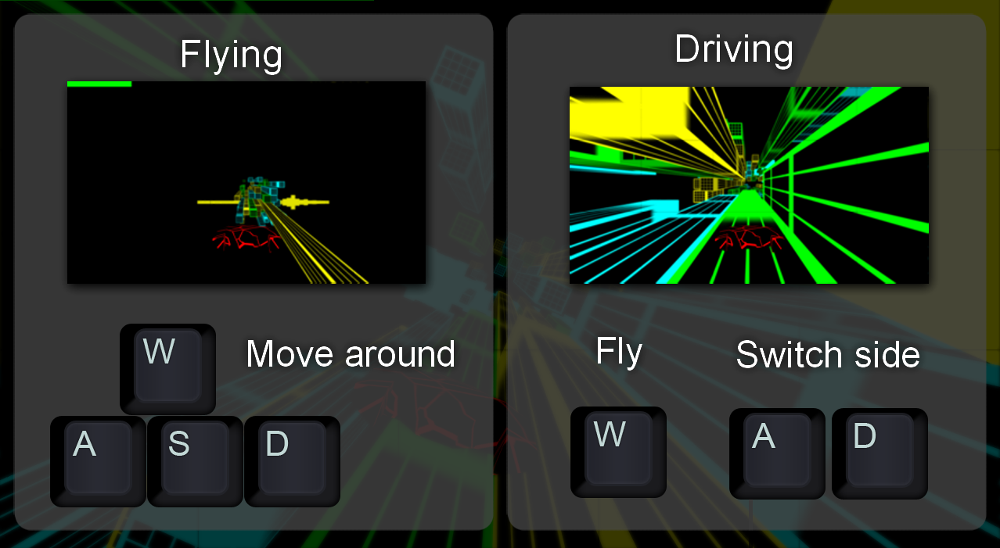

# Project
This game was a 2-week-project of the CGA (computergraphics & animations) lecture and also my first time using OpenGL.
The goal was to use the techniques we learned in the lecture and create a graphical demo or game in java.
But my personal goal was to create a rhythm game in a tron theme and learn about deferred rendering & glow-shaders.
The project wasn't updated since end of the project and currently I want to bring this project back to a
more polished state which does fit my current standards.

# NeonFall

NeonFall is an tron-themed rhythm-game.
The goal of this game is to fly as long as you can from track to track
without colliding the front of a track or emptying your energy-bar.
Energy will be drained if you are flying and filled when you driving on a track.

# Deferred Rendering
Deferred Rendering is a performance improving technique which renders information like depth, color and normals
into seperate textures with MRT (Multiple render targets). With these you compute effects like light in image space rather
then in world space. So instead of needing O(lights * primitives) calculations you have O(lights + primitives) which is a huge
performance boost. In this project it will be used to create glowing objects.

# Glow-Shader

A glow-shader let objects which are illuminating light glow with an aura around them. Which is called **bleeding**.
Basic glow-shaders renders glowing objects into a seperate texture which will be then blurred with a gaussian blur effect as example.
After the glow-texture was blurred you map the texture onto the current scene with an additive or multiplicative approach.
As you can see on the images there is no need in NeonFall to seperate glowing objects and non-glowing objects because every object is glowing.

# Spectrumbars

The spectrumbars move while the music is playing.
Frequencies are extracted by a fourier-transformator and it is possible to put any mp3-file into the music directory.
It was the plan back then to use these frequencies for glowing by beat, changing the difficulty of the game or moving
tracks by beat but it didn't made it to the end of the project.

# How to play

While flying you move with the WASD-Keys. It is only possible to move in steps like on a grid.
Move onto the sides of a track and it will land automatically.
While driving you move with WAD-Keys. With A and D you can move around the track and even switch to other tracks nearby.
If a track ends or by pressing W you will automatically change to flying.

# Artists Copyright
Running In The Streets by Vyra | https://soundcloud.com/vyramusic \
Music promoted by https://www.free-stock-music.com \
Creative Commons Attribution-ShareAlike 3.0 Unported \
https://creativecommons.org/licenses/by-sa/3.0/deed.en_US
